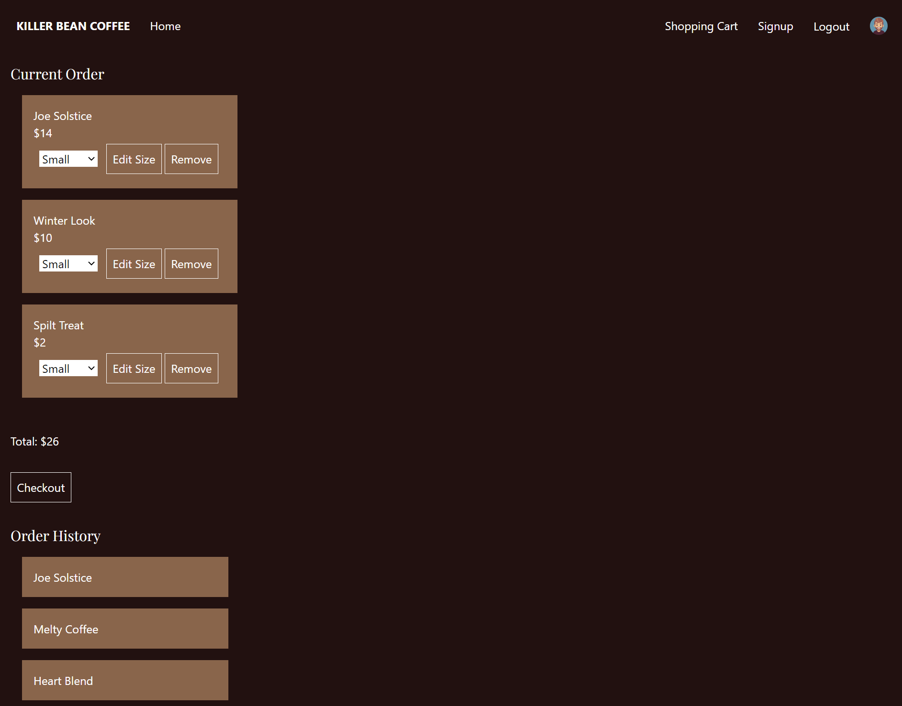

# Killer Bean Coffee - A Ruby on Rails & React App

Killer Bean Coffee is a SPA that allows a user to order coffee from a faux coffee shop. After a user signs up to the site, they can log in and view all of the coffee varieties. This app uses BCrypt to safely hash and store passwords. 


If the user is logged in, they can view their current order and all previous orders in the shopping cart. After their checkout is complete, they can logout and end their session.



---

### Technologies

* Ruby version - 3.0.0
* Rails version - 7.0.4
* React version - 18.2.0
* BCrypt
* TailwindCSS 

---
### Installation 

This app uses npm for package management. It also uses PostgreSQL for database management. 

run:
```
bundle install
```
Then to get the back end and front end servers started, run:
```
rails s
```
In a separate terminal, run:
```
npm start --client prefix
```
Once the servers are started, seed the database by running 
```
rails db:seed
```

---

### Authors

* Megan Moulos 
    - meganmoulos@gmail.com
    - [Megan's Github](https://github.com/meganmoulos)
* Tyler DiRaffaele  
    - tylerdiraffaele@gmail.com
    - [Tyler's Github](https://github.com/tylerdira)


